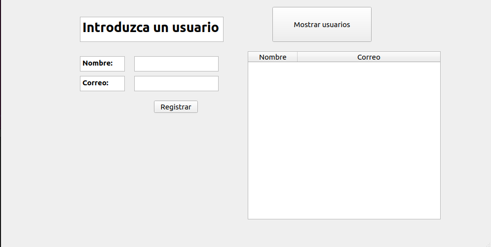

# ¿Para qué sirve el repositorio?

Es un sistema de gestión de cursos, en el que se guarda la información requerida sobre ellos,
incluyendo los profesores, alumnos inscritos, recursos asignados, etc.

